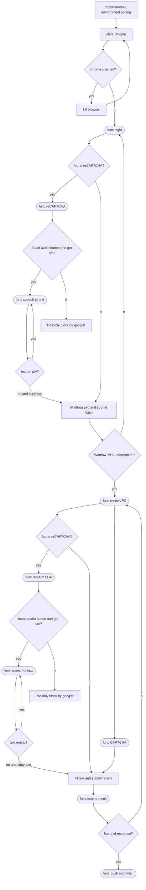

# How this work

```mermaid
    flowchart TD;
        A[import module, \n environment setting]-->B[start_chrome];
        B-->C{chrome crashed?};
        C--yes-->D[kill browser]-->B;
        C--no-->E([func login])-->F{found reCAPTCHA?};
        F--yes-->G([func reCAPTCHA])-->I{found audio button and get src?};
        I--yes-->J([func speech to text])-->K{text empty?};
        I--no-->L[Possibly block by google!];
        K--yes---->J;
        K--no and copy text-->H;
        F--no-->H[fill id/passwd and submit login];
        H-->M{Window 'VPS Information'?}--yes-->N([func renewVPS])-->FF{found reCAPTCHA?};
        M--no-->E;
        N-->O([func CAPTCHA])-->P[fill text and submit renew];
        FF--yes-->GG([func reCAPTCHA])-->II{found audio button and get src?};
        FF--no-->P;
        II--yes-->JJ([func speech to text])-->KK{text empty?};
        II--no-->LL[Possibly block by google!];
        KK--yes---->JJ;
        KK--no and copy text-->P;
        P-->Q([func extend result])-->R{found id:response?}--yes-->S([func push and finish]);
        R--no-->N;
```
